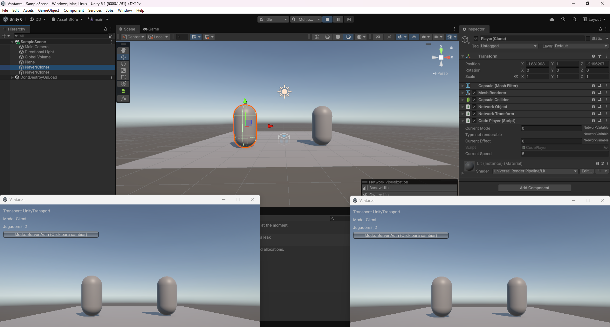
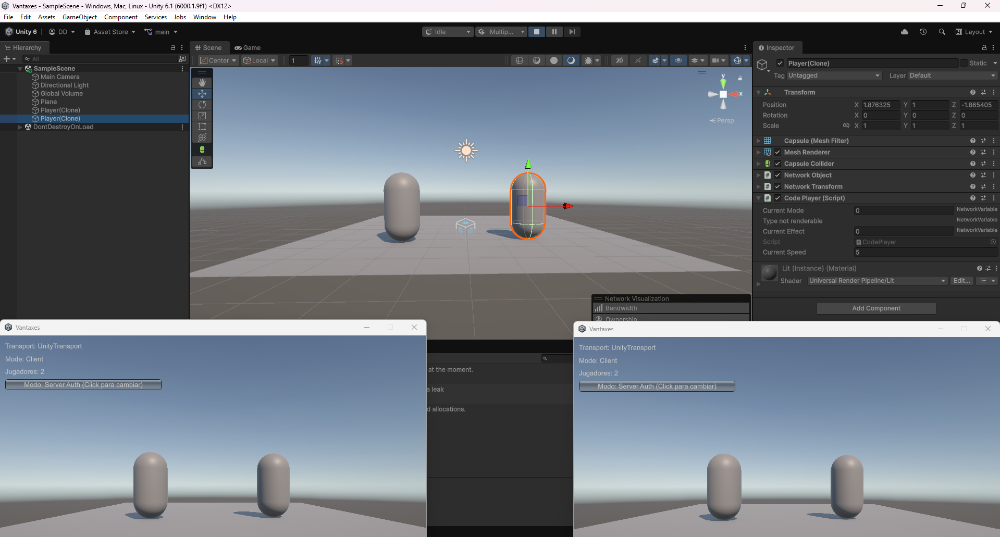
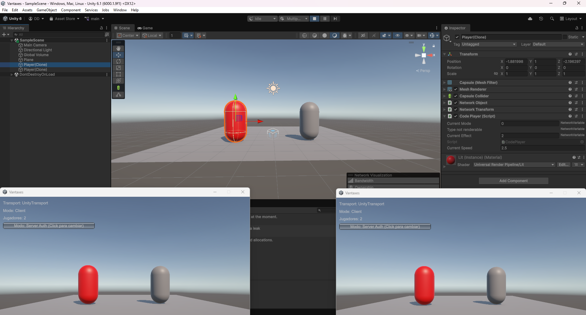
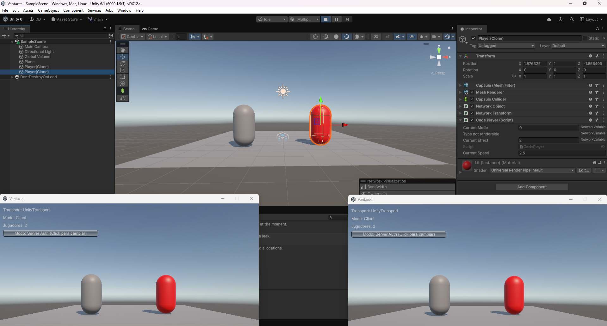
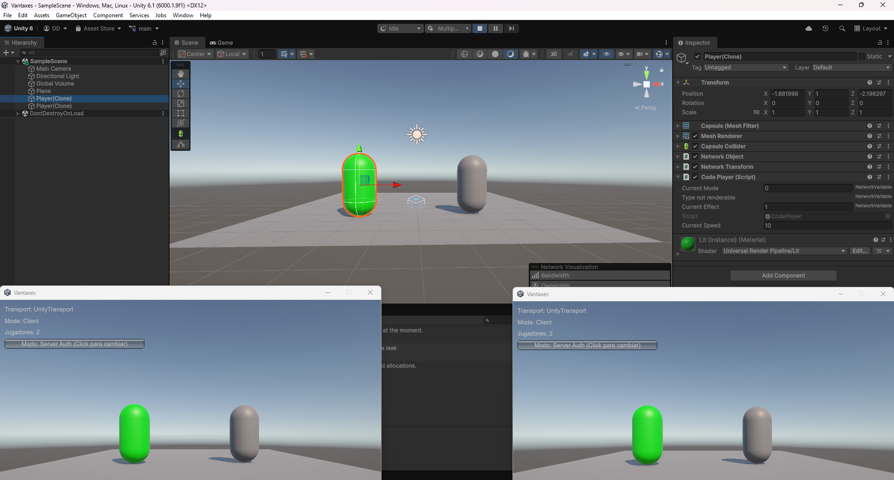
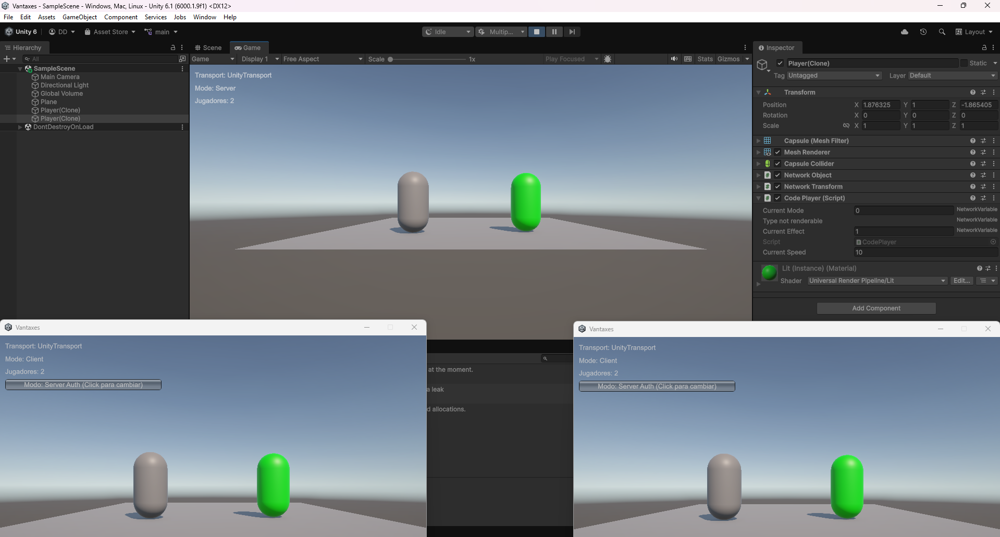

# Informe

Las siguientes imágenes muestran el entorno de desarrollo con el editor de Unity de fondo para demostrar cómo se modifican los datos de red en tiempo real. La ventana flotante de la izquierda pertenece al jugador de la izquierda, mientras que la ventana de la derecha corresponde a la pantalla del jugador de la derecha.

### 1. Estado Base (Sin efectos activos)
En estas imágenes se puede observar cómo ambos jugadores mantienen la velocidad base de **5**. Este dato se puede verificar en la parte derecha del editor de Unity, dentro del *Inspector*, en el componente desplegado donde se aprecia el valor de `Current Speed` en 5 y un `Current Effect` de 0 (estado normal).

 
---
### 2. Aplicación de la Desventaja (Velocidad reducida)
En estas imágenes se puede observar cómo se aplica la desventaja de forma individual. El sistema selecciona aleatoriamente a un único jugador por ciclo, reduciendo su velocidad a **2.5** (`Current Speed`), lo cual modifica automáticamente su material visual cambiándolo a color rojo en todas las instancias de la red mientras el otro jugador permanece inalterado.

 

### 3. Aplicación de la Ventaja (Velocidad incrementada)
En estas imágenes se observa el comportamiento cuando se activa la ventaja en la partida. Al ser elegido, el jugador seleccionado duplica su velocidad de movimiento alcanzando un valor de **10** en el campo `Current Speed`. Este cambio de estado altera su renderizado en tiempo real tornándolo de color verde, una actualización que se propaga instantáneamente a las pantallas de ambos clientes.

 

**Nota técnica sobre la captura número 6:** En la última imagen se puede apreciar detalladamente en la interfaz de fondo que el editor de Unity está actuando estrictamente bajo el rol de **Servidor dedicado** (*Mode: Server*) y no como Host o Cliente.